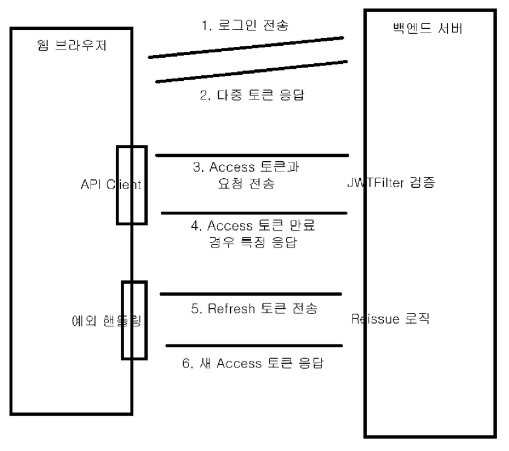

    

# 1. JAVA WEB TOKEN 관리

- **로그인 성공 시 JWT 발급**: 사용자가 로그인하면 서버는 클라이언트에게 **JWT 발급**

- **권한이 필요한 요청**: 클라이언트는 요청 시 JWT를 서버로 전송하여 인증

---

# 2. 다중 토큰 : Access Token 및 Refresh Token

- **Access 토큰**: 짧은 생명주기(약 10분)를 가지고, 권한이 필요한 모든 요청에 사용

 
- **Refresh 토큰** : 긴 생명주기(24시간 이상)를 가지고, Access 토큰이 만료되었을 때 새로 발급받기 위해 사용

---

# 3. Token 탈취에 따른 해결방안

- **1. Refresh Rotation** : Refresh Token이 탈취 당할 수 있는 상황에 보완할 수 있도록 Access Token 갱신 시 서버에서 Refresh Token와 함께 재발급하여 
프론트 측에 응답

  
- **2. Refresh Token 서버 저장** : RDB 또는 Redis와 같은 데이터베이스를 통해 Refresh 토큰을 저장한다. 이때 Redis의 경우 TTL 설정을 통해 생명주기가 끝이난 토큰은 자동으로 삭제할 수 있는 장점이 있으나, 해당 예제에서는 RDB에 저장했다.
---
